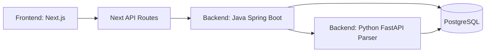

# TradeLab

<p align="center">
  
</p>

TradeLab is a monorepo for researching, running, and comparing trading scenarios.
It includes a Next.js frontend, a Java API layer, and a Python market-data parser service.

## Architecture (Mermaid)



## Current Repository Structure

```text
TradeLab/
|-- frontend/               # Next.js app (UI + API proxy routes)
|   |-- app/
|   |-- components/
|   |-- features/
|   |-- lib/
|   `-- public/
|-- backend/
|   |-- java/               # Spring Boot API
|   `-- python/             # FastAPI parser/import service
|-- docs/                   # Product/engineering docs
|-- archive/                # Archived files and snapshots
`-- docker-compose.yml      # Full stack local orchestration
```

## Tech Stack

### Frontend
- Next.js 16
- React 18
- TypeScript
- Tailwind CSS
- Radix UI
- Recharts

### Backend
- Java 17 + Spring Boot 3 (REST API, JPA)
- Python 3.11+ + FastAPI (data import/parser service)
- PostgreSQL 16
- Docker / Docker Compose

## Quick Start

### Option A: Full stack in Docker (recommended)

```bash
docker compose up --build
```

Services:
- Frontend: `http://localhost:3000`
- Java API: `http://localhost:8080`
- Python parser: `http://localhost:8000`
- PostgreSQL: `localhost:5432`

### Option B: Local development

1. Frontend
```bash
cd frontend
npm install
npm run dev
```

2. Python parser
```bash
cd backend/python
python -m venv .venv
.venv\Scripts\activate
pip install -r requirements.txt
uvicorn parser.main:app --host 0.0.0.0 --port 8000
```

3. Java API
```bash
cd backend/java
mvn spring-boot:run
```

## Detailed Documentation

- Frontend guide: [`frontend/README.md`](./frontend/README.md)
- Backend overview: [`backend/README.md`](./backend/README.md)
- Java backend guide: [`backend/java/README.md`](./backend/java/README.md)
- Python backend guide: [`backend/python/README.md`](./backend/python/README.md)

