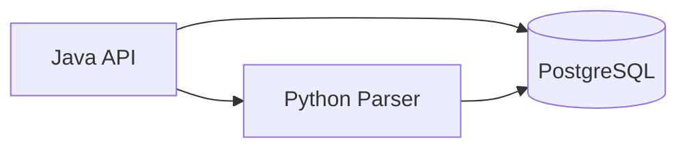

# TradeLab Backend

Backend is split into two services:

- `java/` - Spring Boot API for datasets, candles, and integration with parser.
- `python/` - FastAPI parser/import service for exchange candle ingestion.

## Backend Architecture



## Service Responsibilities

### Java API (`backend/java`)
- REST endpoints for:
  - datasets CRUD (`/api/datasets`)
  - candles query (`/api/candles`)
  - parser import trigger (`/api/imports/candles`)
  - health (`/api/health`, `/api/python/health`)
- Stores dataset payloads in PostgreSQL.
- Calls Python parser via HTTP client.

### Python Parser (`backend/python`)
- Imports candles from supported exchanges (currently Binance).
- Normalizes and upserts candles into PostgreSQL.
- Exposes internal API:
  - `GET /health`
  - `POST /internal/import/candles`

## Quick Start

### Docker Compose (recommended)

From repository root:

```bash
docker compose up --build
```

### Local run (manual)

1. Start PostgreSQL.
2. Start Python parser (`backend/python`).
3. Start Java API (`backend/java`).

## Detailed Guides

- Java backend: [`java/README.md`](./java/README.md)
- Python parser: [`python/README.md`](./python/README.md)

